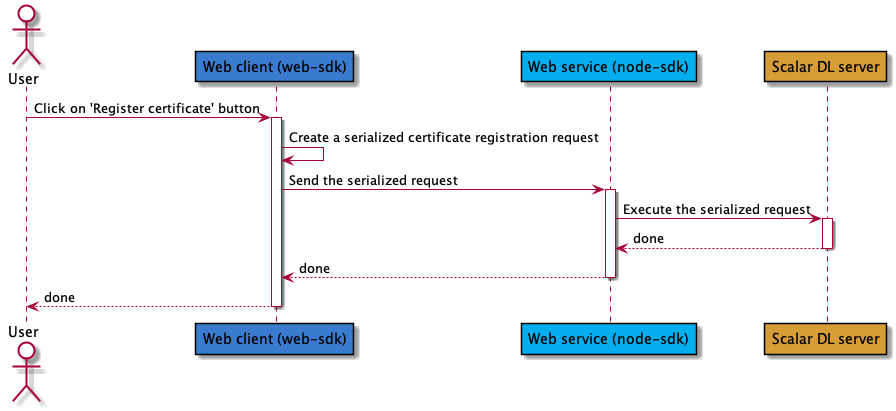

# Use the node sdk to execute serialized request generated by another application
This guide explains how the node sdk can be used as a proxy to execute serialized request.
To present this feature, we will rely on a demonstration application.

## Architecture overview
In this demonstration application, the web client will use the [Scalar DL web-sdk](https://github.com/scalar-labs/scalardl-web-client-sdk) to generate a serialized request then it will
send it to the web service, using the Scalar DL node-sdk, which will execute the request against the Scalar DL server.




### Serialized request creation using the web sdk
By calling the `clientService.createSerializedXXX` method name, it creates the request as a `Uint8Array`.

```javascript
const clientProperties = {
    'scalar.dl.client.cert_holder_id': `foo`,
    'scalar.dl.client.cert_version': 1,
    'scalar.dl.client.private_key_pem': '...',
    'scalar.dl.client.cert_pem': '...',
  };
const clientService = new Scalar.ClientService(clientProperties);
const serializedCertificateRegistrationRequest = await clientService.createSerializedCertificateRegistrationRequest();
```

For the full code, please refer to the [source](web-client/index.html) file.

### Serialized request execution using the node sdk

To execute a serialized request, it just needs to be passed as is to its corresponding method.

```javascript
const  binaryClientProperties= {
  'scalar.dl.client.server.host': '127.0.0.1',
  'scalar.dl.client.server.port': 50051,
  'scalar.dl.client.server.privileged_port': 50052,
};
const binaryClientService = new ClientServiceWithBinary(binaryClientProperties);
await binaryClientService.registerCertificate(serializedCertificateRegistrationRequest);
```

It should be noted that since the binary client service is only executing the request which was created before by web-client,
the binary client service does not require the user private key if it only executes serialized request as in a way it only passes the already created request along to the Scalar DL server.

For the full code, please refer to the [source](web-service/node-server.js) file.

## Run the sample application

If you are interested in trying out this sample application, first you need to have a running [Scalar DL environment](https://scalardl.readthedocs.io/en/latest/) on localhost.

Then, start the web-service which will execute the serialized request.
```
cd web-service
npm install
node node-server.js
```

Finally, open the web-client self contained [html page](web-client/index.html) with your browser to send request.
