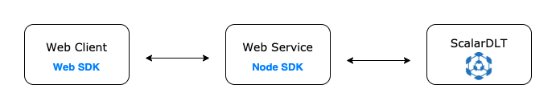

# A Guide on How to Execute a Serialized Request in Client SDKs
This guide briefly explains how to execute a serialized request in client SDKs by looking at how Node SDK can execute a request created by Web SDK.

## Prerequisite
The diagram below shows the whole architecture of this guide.



Web client is the client side (for example browser or mobile devices) of a product/service that is
integrated with ScalarDLT, normally we would serialize the requests into one binary array (Uint8Array)
and send to a designated backend service (Web service). Web service is the backend of the product/service where all the
business logic are executed here. In this guide, the web service would just forward the serialized
binary requests from the client side to the scalarDLT server. Therefor the web service and scalarDLT
server has to be up and running.
Refer here on how [run a ScalarDLT server](https://scalardl.readthedocs.io/en/latest/) .

`Web-client` and `Web-service` Scalar DL SDKs are initialized as follows:
```
// web-client
const webClientProperties = {
    'scalar.dl.client.cert_holder_id': `foo@`,
    'scalar.dl.client.cert_version': 1,
    'scalar.dl.client.private_key_pem': '...',
    'scalar.dl.client.cert_pem': '...',
  };
const webClient = new Scalar.ClientService(webClientProperties);

// web-service
const properties = {
  'scalar.dl.client.server.host': '127.0.0.1',
  'scalar.dl.client.server.port': 50051,
  'scalar.dl.client.server.privileged_port': 50052,
};
const webService = new ClientServiceWithBinary(properties);
```

## Run the sample
```
npm install web-service/; # install all the dependencies required by this guide
node web-service/node-server.js # run the scalardlt node-sdk server 
```

### Send Scalar DL requests from the browser
The Scalar DL web client request can be invoked via the html file [here](./web-client/index.html)