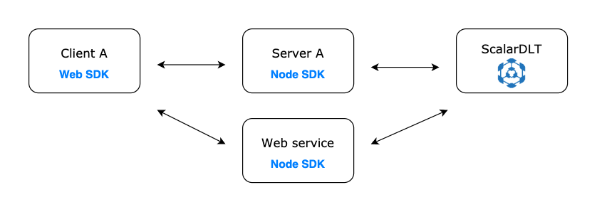

# Web-node validation
This sample code is to demonstrate that the node sdk can be used to execute Scalar DL binary request build by another application using any Scalar sdk.



In conclusion, the listContracts request sent by Web SDK can be executed by ScalarDLT invoked from node sdk if the
`ClientProperties` provided by the Web SDK is appropriate. 

## Project Prerequisite
Make sure your ScalarDLT server is up and running by referring to [Scalar DL official documentation](https://scalardl.readthedocs.io/en/latest/). 
```
./app up
```

## Spin up node server
```
node node-server.js
```
##
The Scalardl web client request can be invoked via the html file [here](./web-client/index.html)